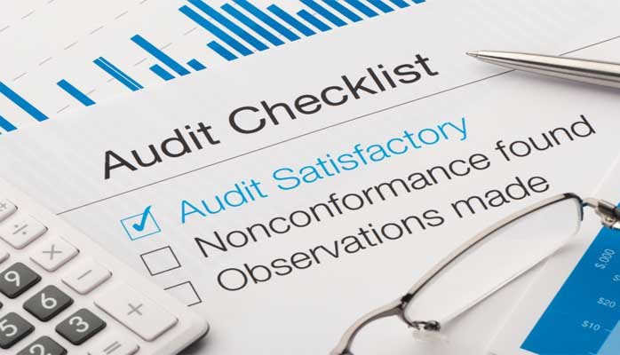

# Workers' Compensation, Liability, and Property Claims Audits

SCD has performed numerous claims audits for its clients. These claims
audits have been of workers' compensation, casualty / liability,
property, or collegiate athlete medical insurance programs.

We compare the quality of claims management performance against one or
more documented procedures:

{ align=right width=350 }

- Leading industry practices, which are activities that insurers, TPAs,
  and self-administered programs have developed that assist the
  adjusters and supervisors in working toward optimal outcomes.
- Contractual requirements, either in the form of the formal contract or
  in the form of special service instructions that have been developed
  that clarify roles and responsibilities of the client and the claims
  administrator.

Claims audits provide valuation information to improve the level of
service and ensure that the claims administrators know that their
activities are being fairly and objectively measured.

We will also review loss and management reports, procedures manuals,
and other documents. These will provide us with additional background
information regarding your program.

We will randomly select a sample of claims for the claims audit. The
sample will include claims from each line of business, claim office, or
adjuster to meet your needs.

We have developed a claims audit template that allows us to evaluate
how a claims administrator's activities compare to these metrics. We
review the claim files to assess the performance compared to these
activity-based requirements. We also review the outcomes of the claims
management work based on the action plans developed by the claims
personnel.

Based on our evaluation, we provide our clients with a draft report
which measures the claims administrator's performance in several
critical claims management areas, and identifies any gaps between its
performance and the standards. We then provide recommendations to close
any gaps. We assist our clients in setting priorities for improvement.
