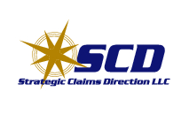

# Strategic Claims Direction LLC

{ align=left width=180 }

Strategic Claims Direction (SCD) is a claims consulting firm which works
with companies, insurers, risk pools, public entities, and third party
administrators to improve claims management procedures and performance.
Our goal is to work with you to responsibly manage your claims by
improving efficiency and effectiveness to reduce claims costs and
expenses. We can help in a variety of ways, depending upon your most
critical needs.

**We often hear comments or questions from our clients such as:**

1. **We need a claims audit from an independent and experienced claims
   professional because**
    - our board has requested one
    - a state agency requires one every X years
    - AGRiP requires one to meet certification requirements

    *OR...*

    **We are not sure our TPA, insurer, or self-administered claims
    program are managing claims as they should. How can we find out?**

    *OR...*

    **Our claims costs keep going up even though our employee count is
    down OR our incident count is down OR we have done a lot to improve
    our claims and safety program. We are not sure why this is the
    case. Can you help us?**

    SCD can perform a cost-effective claims audit of a sample of claims
    to objectively measure claims performance against leading industry
    practices and your company's specific performance requirements. We
    will then provide you with recommendations for improvement where it
    is needed. In many cases we can perform this through on-line access
    to the claims system, eliminating travel expenses.

2. **We have questions about the reasonableness of our case reserves.
   How can we evaluate the reserves?**

    SCD can review the claims reserving processes and procedures to
    determine if they are reasonable and are being followed. We will
    also prepare independent assessments of the case reserves for a
    sample of claims. If needed, we can provide this information to
    your casualty actuary.

3. **We need to select a third party administrator (TPA) but need help
   defining our needs and evaluating responses so we get the best TPA
   for us. Can you help?**

    SCD will prepare a needs assessment based on your company and its
    specific needs. We will then develop performance requirements, help
    create the Request for Proposal (RFP), and assist you through the
    selection process. We can also help you through the implementation
    or transition process if needed.

4. **We are concerned that our claims processes are inefficient. How do
   we assess that? Can you help?**

    SCD can perform a claims process efficiency assessment to compare
    your processes and procedures with those recognized as using
    leading industry practices. We will identify processes to retain as
    well as identify redundant or unnecessary steps that should be
    eliminated or revised. We can also help you evaluate the roles and
    responsibilities of your claims personnel and determine if certain
    functions or responsibilities should be delegated or assigned to
    others.

Based on our assessment of your program, we will provide you with
priorities, recommendations, and a roadmap to improve your claims
program.

{ width=120 style="border-radius:50%" }

### Gary Jennings

As founder and principal of Strategic Claims Direction, Gary has over 40
years experience in claims management, with 20 years of claims
consulting experience. He has earned the CPCU, ARM, ALCM, AIC, ARe, and
SCLA professional designations.

Gary has experienced many different facets of claims administration,
having worked for an insurer, a TPA, an independent adjusting firm, a
corporate claims organization, and two of the Big 4 consulting firms
prior to forming SCD. He brings real-world solutions to meet your claims
management needs.

[View Gary's LinkedIn profile](https://www.linkedin.com/pub/gary-jennings/1/428/346){ .md-button }

---

**Contact Us @ (678) 520-3739**

Or [send us an email](mailto:Gary.Jennings@StrategicClaimsDirection.com)

