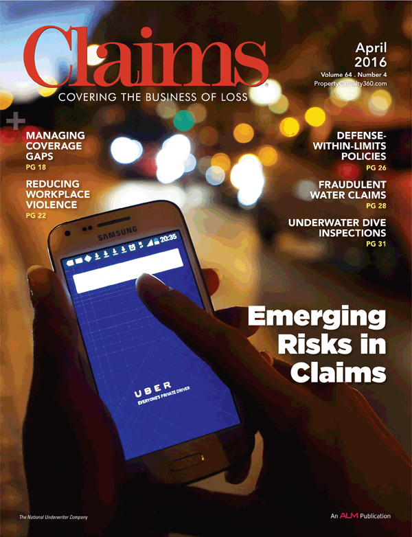

# Published Articles

Gary has written numerous articles for professional magazines and
journals. A sample of the articles is shown below in several major
claims management categories. Gary's articles in Claims magazine can
also be found at
[PropertyCasualty360°](http://www.PropertyCasualty360.com/author/gary-jennings).

## General Topics

{ align=right width=140 }

- "Plant Closing: Lock the Doors and Throw Away the Key", Risk
  Management, Apr. 1996, pp. 83 – 89.
- ["8 Corporate Claims Management Fundamentals"](http://www.propertycasualty360.com/2013/12/03/8-corporate-claims-management-fundamentals),
  Claims magazine, Dec. 2013, and PropertyCasualty360 (PC360).
- ["Using More of What's Already 'In the Box'"](http://www.propertycasualty360.com/2014/02/20/using-more-of-whats-already-in-the-box),
  Claims magazine, Mar. 2014, and PC360.
- ["Don't Swim With The Shirks"](http://www.propertycasualty360.com/2014/05/01/dont-swim-with-the-shirks),
  Claims magazine, May 2014, and PC360.
- ["Avoiding 'Malfunction Junction' in Claims Management"](http://www.propertycasualty360.com/2014/07/01/avoiding-malfunction-junction-in-claims-management),
  Claims magazine, Jul. 2014, and PC360.
- ["Stuck on an unusual workers' comp claim? Don't give up until you read this."](http://www.propertycasualty360.com/2014/09/23/stuck-on-an-unusual-workers-comp-claim-dont-give-u)
  Claims magazine, Oct. 2014, and PC360.
- ["The Value of Accountability in Claims Management"](http://www.propertycasualty360.com/2014/10/13/the-value-of-accountability-in-claims-management),
  Claims magazine, Nov. 2014, and PC360.

<iframe title="Sound Cloud Player track 297538843" width="80%" height="166"
  scrolling="no" frameborder="no"
  src="https://w.soundcloud.com/player/?url=https%3A//api.soundcloud.com/tracks/297538843&amp;color=ff5500&amp;auto_play=false&amp;hide_related=false&amp;show_comments=true&amp;show_user=true&amp;show_reposts=false">
</iframe>

- ["Don't Run Your Claims Management on Autopilot"](http://www.propertycasualty360.com/2016/02/24/dont-run-your-claims-management-on-autopilot),
  Claims magazine, Feb. 2016, and PC360.
- ["There's a Coverage Gap with that App"](http://www.propertycasualty360.com/2016/04/19/theres-a-coverage-gap-with-that-app),
  Claims magazine, Apr. 2016, and PC360.
- ["Workers' Compensation & Return to Work Programs: 3 Reasons for Failure and How to Overcome Them (Part 1)"](http://blog.primacentral.org/content/workers-compensation-return-work-programs-3-reasons-failure-and-how-overcome-them-part-1),
  Public Risk Management Association, Jan 2017
- ["Workers' Compensation & Return to Work Programs: 3 Reasons for Failure and How to Overcome Them (Part 2)"](http://blog.primacentral.org/content/workers-compensation-return-work-programs-3-reasons-failure-and-how-overcome-them-part-2),
  Public Risk Management Association, Mar 2017
- ["Loss Control: A Claims Perspective"](http://blog.primacentral.org/content/loss-control-claims-perspective),
  Public Risk Management Association, Aug 2017

## Catastrophes

- ["Planning for Catastrophes"](http://www.propertycasualty360.com/2015/04/08/planning-for-catastrophes),
  Claims magazine, Apr. 2015, and PC360.

## Claims Audits

{ align=right width=140 }

- ["Claims Auditing is a Springboard to Cost Reduction"](http://www.propertycasualty360.com/2013/08/14/claims-auditing-is-a-springboard-to-cost-reduction),
  Claims magazine, Sept. 2013, Workers' Comp Watch, Aug 2013, and PC360.
- ["Fast-Track Resolution, Indemnification with Property Claims Audits"](http://www.propertycasualty360.com/2013/09/24/fast-track-resolution-indemnification-with-propert),
  Claims magazine, Oct. 2013, and PC360.
- ["The 'Split Personality' of Liability Claims"](http://www.propertycasualty360.com/2013/10/16/complex-audits-the-split-personality-of-liability),
  Claims magazine, Nov. 2013, and PC360.

## Cost Allocation

- "Insurance and Claims Cost Allocation", The Journal of Workers'
  Compensation, Fall 2002, Vol.12, No.1, pp. 30 – 42.

## Fraud

- ["3 Most Common Types of Workers' Comp Fraud"](http://www.propertycasualty360.com/2014/11/11/here-are-the-3-most-common-types-of-workers-comp-f),
  Claims magazine Dec. 2014, BenefitsPro on 11/13/14, and PC360.

## Litigation Management

- ["A Proactive Approach to Reducing Claims Litigation"](http://www.propertycasualty360.com/2016/07/01/a-proactive-approach-to-reducing-claims-litigation),
  Claims magazine, Jul. 2016, and PC360.

## Processes & Procedures

- "Claim Process Flows: How They Affect Claims Outcomes," Public Risk
  magazine, March 2014.

## Reserving

- "A Risk Manager's Guide to Claims Reserving", The John Liner Review,
  Summer 2004, Vol. 18, No. 2, pp. 62 – 73.
- ["Under Pressure: The Temptation to Reduce Reserves Can Increase in a Poor Economy"](http://www.propertycasualty360.com/2010/02/01/under-pressure),
  Claims magazine, Feb. 2010, and PC360.

## Self Administration

- "The Pros and Cons of Self-Administration", The Journal of Workers'
  Compensation, Spring 2003, Vol. 12, No. 3, pp. 50 – 62.

## Systems & Data Analysis

{ align=right width=140 }

- ["Great Expectations: Successful System Implementations Require Clear Communication"](http://www.propertycasualty360.com/2008/11/26/great-expectations),
  Claims magazine, Dec. 2008, and in PC360.
- "Abundant Claim Information: Boon or Bane?" The John Liner Review,
  Summer 2010, pp. 47 – 51.
- ["To Foster Claims Excellence, Begin with the Right Metrics"](http://www.propertycasualty360.com/2014/01/14/to-foster-claims-excellence-begin-with-the-right-m),
  Claims magazine, Feb. 2014, and PC360.
- ["It's the Data, Stupid!"](http://www.propertycasualty360.com/2014/07/30/its-the-data-stupid)
  Claims magazine Aug. 2014, and PC360.
- "Metrics for Improved Claims Outcomes", Public Risk magazine, Sep.
  2014.

## TPA Evaluation & Selection

- "The ABCs of TPAs: Selecting Your Company's Third Party
  Administrator", The Journal of Workers' Compensation, Summer 2004,
  Vol. 13, No. 4, pp. 61 – 70.
- ["Top 10 Characteristics to Look for in Your Claims Administrator"](http://www.propertycasualty360.com/2013/12/20/top-10-characteristics-to-look-for-in-a-claims-adm),
  Claims magazine, Jan. 2014, and PC360.

## Telecommuting

- "Out of Site", Risk & Insurance, Aug. 1994, p. 22

## Transportation Industry

- ["5 Solutions for Workers' Comp Challenges in the Trucking Industry"](http://www.propertycasualty360.com/2015/01/26/5-solutions-for-workers-comp-challenges-in-the-tru),
  Claims magazine, Feb. 2015, and PC360.

## Training

- ["Claims Ethics"](http://www.propertycasualty360.com/2014/12/29/claims-ethics)
  Claims magazine, Jan. 2015, and PC360.
- ["Practice Makes Perfect – The Role of Employee Training"](http://www.propertycasualty360.com/2016/01/12/here-are-4-ways-to-give-your-claims-professionals),
  Claims magazine, Jan. 2016, and PC360.
